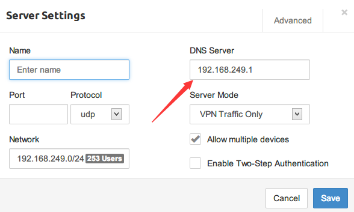

= 使用`DNSMASQ`搭建DNS服务器

== 介绍

DNSmasq是一个小巧且方便地用于配置DNS和DHCP的工具，适用于小型网络，它提供了DNS功能和可选择的DHCP功能。它服务那些只在本地适用的域名，这些域名是不会在全球的DNS服务器中出现的。DHCP服务器和DNS服务器结合，并且允许DHCP分配的地址能在DNS中正常解析，而这些DHCP分配的地址和相关命令可以配置到每台主机中，也可以配置到一台核心设备中（比如路由器），DNSmasq支持静态和动态两种DHCP配置方式。
DHCP也支持用BOOTP(Bootstrapping Protocol引导协议)/TFTP（Trivial File Transfer Protocol普通文件传送协议）/PXE（Pre-boot Execution Environment预启动运行环境）来启动无磁盘的网络设备。
DNSmasq主用适用于适用NAT的家庭网络，用modem，cable modem，ADSL设备连接到因特网，对于那些需求低资源消耗且配置方便简单的小型网络（最多可支持1000台主机）是一个很好的选择。
目前支持该软件的系统包括：Linux (with glibc and uclibc), *BSD, Solaris 和 Mac OS X。
目前支持DNSmasq的Linux平台包括：Gentoo, Debian, Slackware, Suse, Fedora, Smoothwall, IP-Cop, floppyfw, Firebox, LEAF, Freesco, fli4l, CoyoteLinux, Endian Firewall 和 Clarkconnect。也支持FreeBSD, OpenBSD 和 NetBSD 。也使用在思科的Linksys 无线路由器（dd-wrt, openwrt and the stock firmware) 中还有m0n0wall 项目。

DNSmasq提供如下特点：

. 对于使用了防火墙的设备，DNS的配置是比较简单的，并且不依赖于ISP的DNS服务器。
. 在客户端上做DNS查找时，如果连接到英特网的modem被关闭了，查找动作将立即暂停。
. 在使用了防火墙的设备中，/etc/hosts这个文件中存储了一部分主机的名字，而DNSmasq会为这些主机提供服务，如果本地机器的名字都在这个文件中，这时所有的主机都能被服务到，而不用在每个主机中都维护/etc/hosts目录了。
. 集成的DHCP服务器支持静态和动态的DHCP租约服务，多态的网络和多样的IP范围，它通过BOOTP继电器工作，并且支持DHCP的一些选项，包括RFC3397，DNS选项列表。用DHCP配置的机器能自动获取他们的域名信息，这些信息包含在DNS里，同时，这些名字也可以靠机器自己来指定，或者在DNSmasq配置文件里集中将一个域名和一个MAC地址绑定存储。
. DNSmasq把因特网地址和地址-域名映射关系放入cache中，减少服务器负担的同时也提升了性能（特别是在modem连接中）。
. DNSmasq能配置来自动用PPP或DHCP配置请求从上行域名解析服务器中获取地址信息，如果信息发生改变，它会自动重载这些信息。自从它允许自动配置DNS，linux防火墙的维护者就对这个软件就充满兴趣。
. 在支持IPv6的设备中，DNSmasq既能通过Ipv6与上行服务器交互，又能通过IPV6提供DNS服务，在支持双协议栈（IPV4和IPv6）的设备中,它也能与两种协议交互，甚至可以完成ipv4和IPv6之间的相互转化转发工作。
. DNSmasq能被配置用来向特定的上行服务器发送特定的域名解析请求，从而可以简单的与私有的DNS服务器结合使用。

== 搭建DNS服务

=== 安装

.安装命令
[source, bash]
[caption=代码一、]
----
sudo apt-get install dnsmasq
----

=== 设置

.配置文件`/etc/dnsmasq.conf`
[source, ini]
[caption=代码二、]
----
# Change this line if you want dns to get its upstream servers from
# somewhere other that /etc/resolv.conf.  <1>
#resolv-file=

# If you don't want dnsmasq to read /etc/resolv.conf or any other
# file, getting its servers from this file instead (see below), then
# uncomment this.  <2>
#no-resolv

# Add other name servers here, with domain specs if they are for
# non-public domains.    <3>
#server=/localnet/192.168.0.1

# If you don't want dnsmasq to read /etc/hosts, uncomment the
# following line.
no-hosts   <4>

# or if you want it to read another file, as well as /etc/hosts, use
# this.
addn-hosts=/etc/dnsmasq.hosts   <5>

----

.hosts文件`/etc/dnsmasq.hosts`
[source, hosts]
[caption=代码三、]
----
192.168.249.1  git.xxx.cn
----

.hosts文件`/etc/hosts`
[source, hosts]
[caption=代码四、]
----
127.0.0.1  git.xxx.cn
----

<1> 依然使用`resolv.conf`的配置，不要打开注释。
<2> 同上。
<3> 可以添加一些dns服务器，这里不需要。
<4> 有些服务是本地的，会放到`/etc/hosts`中，与想要调整的域名冲突，故不启用HOST
<5> 自定义的域名文件

[NOTE]
====
有些时候DNS服务器也会承担着一些其他服务，譬如git服务器，此时git服务器对于
本机来说是`127.0.0.1`，对VPN网段来说是`192.168.249.1`，对内网其他机器来说是
`192.168.1.251`，因此上述配置文件中，会有(4)、(5)的设置。
====

== VPN服务器设置

VPN服务请参考： link::../openvpn-with-pritunl/readme.asc[使用`pritunl`搭建OpenVPN服务器]

Server的DNS设置如下图

