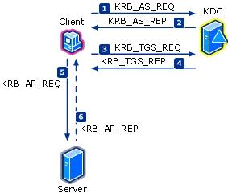
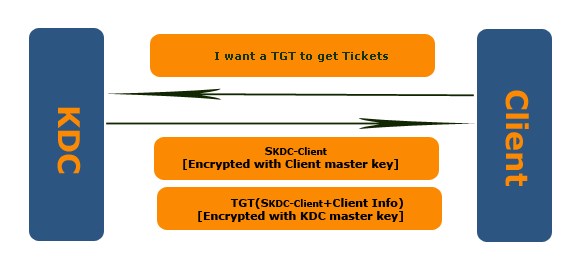
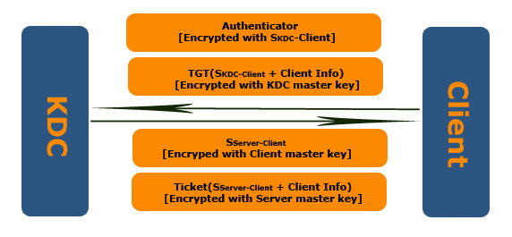
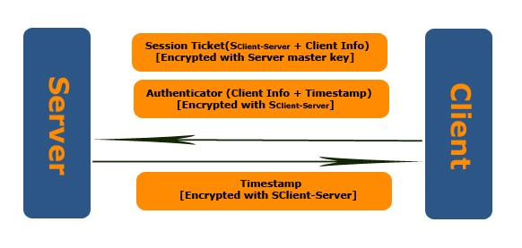
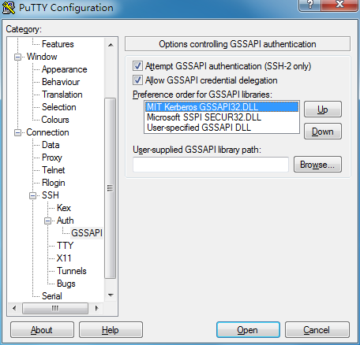

= Kerberos认证

== 术语

=== 主要术语

. Kerberos：一种由 MIT 开发的验证协议
. KDC：Kerberos 认证中心
. Kerberos Client：被验证的客户端，待授权者
. Kerberos Application：被验证的服务端，授权者
. Principal：身份标识
. TGT：Ticket Granting Ticket，用于票据授权的票据

=== Principal

Principal 是身份标识，格式为 primary/instance@REALM

. username@REALM 或 username/instance@REALM，例如 joe@3S.CN 和 joe/admin@3S.CN，这是两个不同的 principal，后者的形式用于不同权限的需要
. service/address@REALM，其中 address 可以是主机名、别名或 IP 地址；service 是服务名称，例如 HTTP
. host/address@REALM。host 其实是一个特殊的服务，用于登录

使用 ssh 登录时，服务名称固定为 host。

== 工作原理

=== 总流程图

=== 步骤

. Client 向KDC 申请TGT：KDC 生成Session-Key(SKDC-Client)，用Client的密钥(密码的salt hash)加密SKDC-Client，然后和TGT一块发给Client
+

. Client 向KDC 获取某Server的 Ticket：TGT原样给 KDC，用SKDC-Client加密自己的信息和要访问Server的信息 发给 KDC，KDC检查无误后发 Ticket
+

. Client 向 Server 出示Ticket 证明自己
+

== SSH 登录配置说明

=== 客户端
==== Kerberos 配置文件

根据系统和版本的不同，Kerberos 配置文件的位置不同

- /etc/krb5.conf  (Linux, OSX 10.6)
- /Library/Preferences/edu.mit.Kerberos  (OSX 10.7, 10.8)
- X:\Windows\krb5.ini (Windows kfw-3-2-2)

==== SSH 配置文件

根据系统和版本的不同，ssh 配置文件的位置不同 (Windows 需自行查看设置)

- /etc/ssh/ssh_config, ~/.ssh/config  (Linux)
- /etc/ssh_config, ~/.ssh/config (OSX 10.x)

==== 主要配置项说明

krb5.conf (krb5.ini 或 edu.mit.Kerberos )，仅为例子和说明

.krb5.conf
[source, ini]
[caption="代码一、"]
----
[libdefaults]
    default_realm = 3S.CN           # 默认 kerberos realm
    dns_lookup_realm = false                # 不使用 dns 查询 realm (域名到 realm 的映射)
    dns_lookup_kdc = false                  # 不使用 dns 查询 kdc (域名对应的 kdc)

    kdc_timesync = 1
    ccache_type = 4
    forwardable = true
    proxiable = true

    rdns = false                            # 不进行 DNS 反查 (MIT kerberos 有效)
    ignore_acceptor_hostname = true

[realms]
    3S.CN = {                       # realm 3S.CN 的信息
        kdc = krb5auth.3s.cn
        kdc = krb5auth1.3s.cn
        kdc = krb5auth2.3s.cn
        kdc = krb5auth3.3s.cn
        kdc = krb5auth.3s.cn
        master_kdc = krb5auth.3s.cn
        admin_server = krb5auth.3s.cn
        default_domain = 3s.cn
    }

[domain_realm]
    .3s.cn = 3S.CN              # 映射 3s.cn 域及子域到 realm 3S.CN
    3s.cn = 3S.CN               # 当用域名访问服务时需要
----

.ssh_config
[source, ssh_config]
[caption="代码二、"]
----
Host *                                          # 对于所有主机
    GSSAPIAuthentication yes                    # 启用 GSSAPIAuthentication
    GSSAPIDelegateCredentials no                # 不启用 GSSAPIDelegateCredentials
    GSSAPITrustDNS no                           # OSX 10.7, 10.8 使用
----

Putty 配置方法 (请先安装 MIT Kerberos kfw-3-2-2)

.Putty设置

==== 使用技巧

当 ssh 客户端打开 GSSAPIAuthentication 时，如果服务器没有使用 kerberos，会引起登录延时。解决的办法示例如下 （仅为示例）

.~/.ssh/config
[source, ssh_config]
[caption="代码三、"]
----
Host *
    GSSAPIAuthentication no
    GSSAPIDelegateCredentials no
    GSSAPITrustDNS no

Host 192.168.20.*
    GSSAPIAuthentication yes
    User some_username

Host *.byted.org
    GSSAPIAuthentication yes
    User some_username

# always login as root
Host 192.168.20.255
    GSSAPIAuthentication yes
    User root

# trusted server, delegate credentials
Host 192.168.1.1
    GSSAPIAuthentication yes
    GSSAPIDelegateCredentials yes
----

== 相关资源

=== 配置方法

[cols="4"]
|====
|操作系统
|安装软件包
|配置kerberos
|配置ssh客户端
|Windows
|kfw-3-2-2
|X:\Windows\krb5.ini
|取决于客户端
|Linux*
|krb5-user
|/etc/krb5.conf
|/etc/ssh/ssh_config 和/或 ~/.ssh/config
|OS X 10.6
|无
|/etc/krb5.conf
|/etc/ssh_config 或 ~/.ssh/config
|OS X 10.7/10.8
|无
|/Library/Preferences/edu.mit.Kerberos
|/etc/ssh_config 或 ~/.ssh/config
|====

=== 客户端软件

.Kfw-3-2-2
. 官方下载地址：http://web.mit.edu/kerberos/dist/kfw/3.2/kfw-3.2.2/kfw-3-2-2.exe
. 本地下载地址：http://10.2.0.1/krb5/kfw-3-2-2.exe

== 使用方法

=== 一般使用

.初始化
[source, bash]
----
$ kinit username[@BYTEDANCE.COM]
----

.查看当前验证信息
[source, bash]
----
$ klist
----

.清除当前验证信息
[source, bash]
----
$ kdestory
----

.修改密码
[source, bash]
----
$ kpasswd [username[@BYTEDANCE.COM]]
----

=== 授权

使用 SSH 登录服务器时，如果拥有 username@REALM 的 principal （且未过期），登录服务器 A 的 userA 帐号时，能成功登录，当且仅当以下情况

. username = userA
. 目标服务器上存在 ~userA/.k5login 文件，且里面的某一行列出了 username@REALM

~userA/.k5login 可以列出多个 principal，即授权多个身份登录到一个 shell 帐号下。

=== 穿越服务器

穿越服务器是指登录到一个服务器 A 以后，再从服务器 A 登录到服务器 B。以下以默认 GSSAPIDelegateCredentials no 为例。ssh -K 参数用于打开 GSSAPIDelegateCredentials

[source, bash]
----
PC:~$ kinit username
PC:~$ ssh -K userA@host_a_ip_address
HostA:~$ ssh userB@host_b_ip_address
HostB:~$
----

以上示例中，当打开 GSSAPIDelegateCredentials 后，登录到 Host A，会将 tgt 转存到 Host A 上，即可从 Host A 登录 Host B。

WARNING: 安全提示：由于存在身份窃取风险，请确认你在 HostA 上的帐号是安全的，其它用户无法读取你的 credential。
