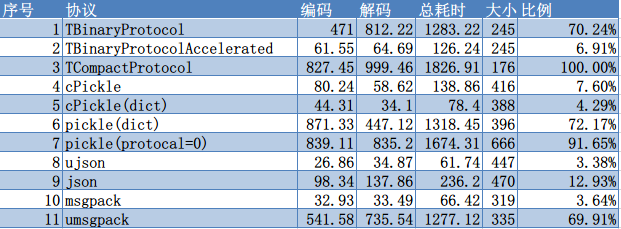

= Python序列化性能对比

开发过程中发现thrift的序列化非常慢（相比cPickle），于是就对常用的序列化方法
进行了一次性能测试，用一个业务数据（用户，包含id、姓名、头像、创建时间等字段），
序列化10000次对比其耗时。代码在结尾处，这里就分析结果好了。

.测试结果

别的就不多说了，这里说一下几种序列化方式的缺点。

* thrift的有点是有schema定义，节省空间，但是在Python 2.7中所有的字符串都是按
utf-8来转换的，这样的话就会有一次转换消耗，若在对象层面进行这种转换，消耗还
不小，大约是自身序列化的一半。
* msgpack也存在字符串编码的问题，它也是把字符串按utf-8转，但是转换的时候是
自动的，不需要显式地转换，也就是说unicode的字符串存进去，取出来的变成了utf-8。

.代码
[source, python]
----
# coding: utf-8
import cPickle
import contextlib
import functools
import json
import pickle
import time
import ujson
import umsgpack
import msgpack
from thrift import TSerialization
from thrift.protocol.TBinaryProtocol import TBinaryProtocolFactory,\
    TBinaryProtocolAcceleratedFactory
from thrift.protocol.TCompactProtocol import TCompactProtocolFactory
from user import ttypes

# 由字符串、整数、日期组成的dict
values = {}
user = process_message_user(values)

i = 0
@contextlib.contextmanager
def timer(desc):
    global i
    i += 1
    t = time.time()
    r = []
    yield r
    et = time.time()
    print "%d %s %.2f %.2f %.2f %d" % (
        i, desc, 1000 * (r[0] - t), 1000 * (et - r[0]),
        1000 * (et - t), r[1])

def encode(user, protocol_factory):
    return TSerialization.serialize(user, protocol_factory)

def decode(data, protocol_factory):
    user = ttypes.User()
    TSerialization.deserialize(user, data, protocol_factory)
    return user

with timer('TBinaryProtocol') as r:
    _encode = functools.partial(encode, protocol_factory=TBinaryProtocolFactory())
    _decode = functools.partial(decode, protocol_factory=TBinaryProtocolFactory())
    for _ in xrange(10000):
        data = _encode(user)
    r.append(time.time())
    for _ in xrange(10000):
        _decode(data)
    r.append(len(data))

with timer('TBinaryProtocolAccelerated') as r:
    _encode = functools.partial(encode, protocol_factory=TBinaryProtocolAcceleratedFactory())
    _decode = functools.partial(decode, protocol_factory=TBinaryProtocolAcceleratedFactory())
    for _ in xrange(10000):
        data = _encode(user)
    r.append(time.time())
    for _ in xrange(10000):
        _decode(data)
    r.append(len(data))

with timer('TCompactProtocol') as r:
    _encode = functools.partial(encode, protocol_factory=TCompactProtocolFactory())
    _decode = functools.partial(decode, protocol_factory=TCompactProtocolFactory())
    for _ in xrange(10000):
        data = _encode(user)
    r.append(time.time())
    for _ in xrange(10000):
        _decode(data)
    r.append(len(data))

with timer('cPickle') as r:
    for _ in xrange(10000):
        data = cPickle.dumps(user, protocol=2)
    r.append(time.time())
    for _ in xrange(10000):
        cPickle.loads(data)
    r.append(len(data))

with timer('cPickle(dict)') as r:
    for _ in xrange(10000):
        data = cPickle.dumps(user.__dict__, protocol=2)
    r.append(time.time())
    for _ in xrange(10000):
        cPickle.loads(data)
    r.append(len(data))

with timer('pickle(dict)') as r:
    for _ in xrange(10000):
        data = pickle.dumps(user.__dict__, protocol=2)
    r.append(time.time())
    for _ in xrange(10000):
        pickle.loads(data)
    r.append(len(data))
with timer('pickle(protocal=0)') as r:
    for _ in xrange(10000):
        data = pickle.dumps(user.__dict__, protocol=0)
    r.append(time.time())
    for _ in xrange(10000):
        pickle.loads(data)
    r.append(len(data))

with timer('ujson') as r:
    for _ in xrange(10000):
        data = ujson.dumps(user.__dict__)
    r.append(time.time())
    for _ in xrange(10000):
        ujson.loads(data)
    r.append(len(data))

with timer('json') as r:
    for _ in xrange(10000):
        data = json.dumps(user.__dict__)
    r.append(time.time())
    for _ in xrange(10000):
        json.loads(data)
    r.append(len(data))

with timer('msgpack') as r:
    for _ in xrange(10000):
        data = msgpack.dumps(user.__dict__)
    r.append(time.time())
    for _ in xrange(10000):
        msgpack.loads(data)
    r.append(len(data))

with timer('umsgpack') as r:
    for _ in xrange(10000):
        data = umsgpack.dumps(user.__dict__)
    r.append(time.time())
    for _ in xrange(10000):
        umsgpack.loads(data)
    r.append(len(data))
----
